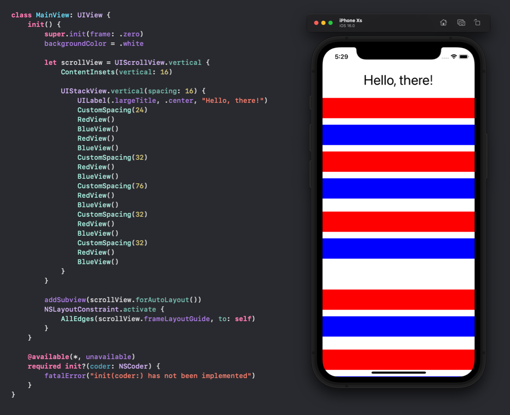

# Result Builders buildFinalResult(_:) Usage

A project to demonstrate a usage I have worked out for `buildFinalResult(_:)`.

The below image shows the code of 3 result builder implementations and the UIKit-driven app that results.

